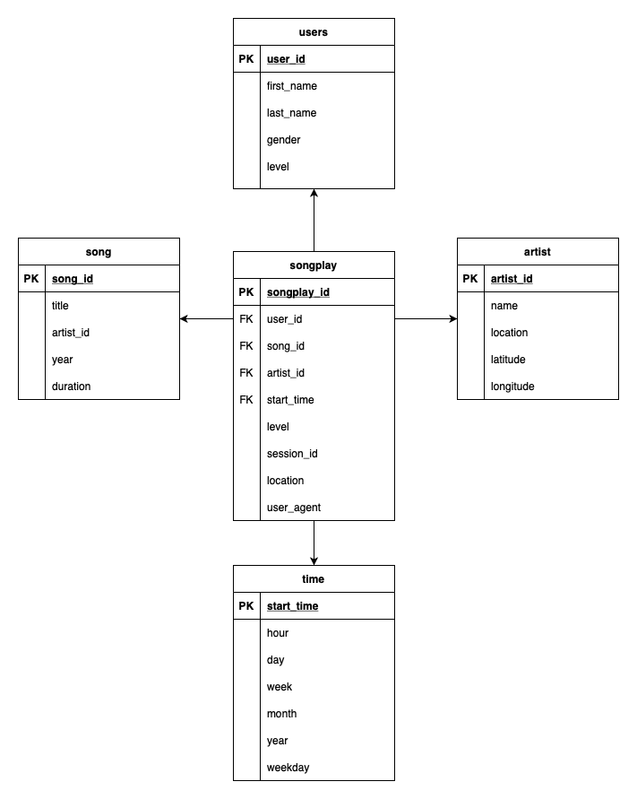

## Purpose

Sparkify is a startup that have a music streaming application. They have grown their user base and song database and want to move their processes and data onto the cloud. They have their data stored in S3, in a directory of JSON logs on user activity on the app, as well as a directory with JSON metadata on the songs in their app.

The goal of this project is to build an ETL pipeline that extracts their data from S3, stages them in Redshift, and transforms data into a set of dimensional tables for their analytics team to continue finding insights in what songs their users are listening to.

The ETL pipeline in this project include the following:
* Create staging tables and the final tables of the star schema in *Redshift*.
* Copy the data from the *S3* bucket into the staging tables.
* Transform and insert data into the final tables.

## Schema 
The used schema in this project:

The main advantage in designing a star schema model, is for the analysis team to find the songs played by the app users. Since their needs are bound to measurable metrics, which can be found in the fact table, then the star schema is the preferred design in this case. Star schemas also have an important advantage: it requires minimum amount of joins between fact and dimension tables, hence higher performance.

## Project Files

Files in this repository are as the following:
* IaC.ipynb: Contains all the processes for creating and managing the cloud resources.
* sql_queries.py: Contains all the drop, create and insert queries.
* create_tables.py: Establish a connection to the Redshift database and create the required tables.
* etl.py: Perform all the ETL processes.
* schema.png: Contains the schema design.
    
    
To run this project, you need to run these files, in the following order:
1. IaC.ipynb, to create the Redshift cluster and all the required resources *Only run the first 4 steps*.
2. create_tables.py, to create the staging and the final Redshift tables.
3. etl.py, to execute the data transformation and load operations.

When done with the project:
* Run step 5 in the IaC.ipynb notebook to delete the cluster and all the resources.